# Become the Dev Star #

## Introduction ##


In this adventure you will pledge allegiance to one of the rebel squads, everyone sharing the same goal  – becoming the Dev Star.

Choose your space fighter platform of choice (Node.js, Java, PHP, Ruby, Go or Python) and develop and deploy cloud native microservices that will help defeat the Alien War Ship.

To complete the different missions, you will build, manage and deploy cloud native microservices.

+ You will use GitHub to manage the source control. You will use Wercker for continuous integration and continuous deployment of your microservices, in a quick and agile way.
+ You will explore and perform actions related to scaling and operating your microservices.
+ You will use your creativity to develop features to your microservices that will help your squad win!

## Introduction ##

The Alien War Ship needs to be defeated. You, your squad and your space microservice fighters are the last hope for planet Earth!

The adventure is intense and a set of missions must be accomplished in order to achieve the desired victory! 


Fortunately, one of our companions is a spy, Tom Kurious, and he has managed to sneak into the Alien War Ship. During our missions, he will report valueable information that might help us to bring down the Alien War Ship!

## How to play ##

#### Objective ####

By developing space fighters (microservices) in either Java, Node.js, PHP, Ruby, Go or Python, you will complete missions in order to defeat the Alien War Ship. The missions will be explained in the instructions below, but you can't complete some of the missions without valuable information from the spy.

## Scoring ##

Your squad will get points as you complete missions. When you have completed all the missions - you will be placed on the Hall Of Fame list and can title yourself a Dev Star! The quicker you complete the missions, the higher you will place yourself on the Hall of Fame list.

## Let's go! ##

 It is now time to select your weapon of choice.

+ Weapon selection strategy is completely up to your preference.
+ Each git repository includes the basic code that is needed in order to run and deploy your microservice to the battle action!


| Weapon        | Git Repo to Fork  |
| ------------- | -----|
| Node.js       |https://github.com/oracledevstar/nodecode|
| Java SE     |   https://github.com/oracledevstar/javacode |
| PHP | https://github.com/oracledevstar/phpcode |
|Ruby       |https://github.com/oracledevstar/rubycode|
| Go    |   https://github.com/oracledevstar/gocode |
| Python | https://github.com/oracledevstar/pythoncode |

1. Click (or right click and open in a new tab) on your preferred weapon's Git repository above and fork into your own repository. 
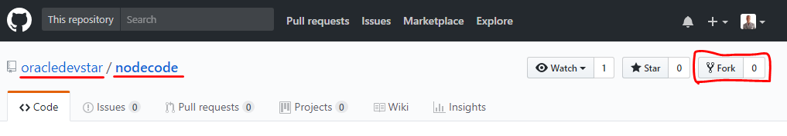

## Mission: Deploy your first fighter! ##

### Mission Description ###

In order to take up the battle against the Alien War Ship, your need to deploy your space fighter (microservice) to the cloud.

### Mission Awards ###

- Number of points for this mission: **100**

### Mission Instructions ###

To deploy your fighter, you will use Continuous Integration and Deployment.
+ First you will connect your cloned GitHub repostiory to a Continuous Integration and Deployment pipeline using Wercker.
+ You will then perform a change on your code.
+ Werker will then automatically build, package and deploy your application to Application Container Cloud. 

**Setting up the Continuous Integration and Deployment pipeline**

1. Open a new window/tab on [https://app.wercker.com](https://app.wercker.com) and use the "Log in in with GitHub" button.

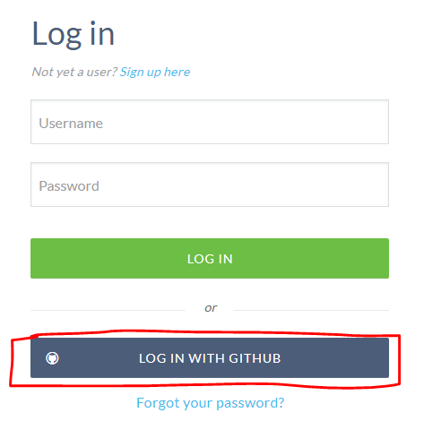

2. Press Authorize Wercker

3. Fill in a desired username and email address and press Finish Up.

4. On the landing page, press **Create your first application**. Alternatively, select **Pipelines** and click **Create an application** to create a new pipeline. 

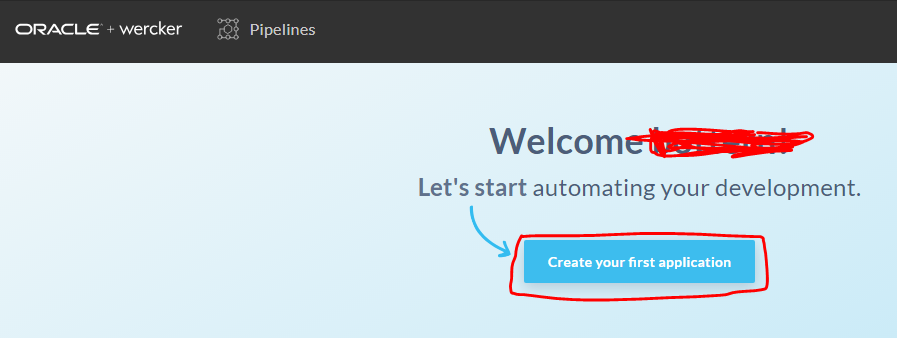

5. Select the application owner. Use the default user and don't select an organization in case you already have one. Press **Next**.

6. Now select the repository you just forked and click **Next**.

7. For the Configure Access dialog, keep the default and press **Next**.

8. Finally, press **Create** to create your application.

It is now time to configure the deployment pipeline. For Wercker to know how it should deploy your application to the Oracle Application Container Cloud, it will need a couple of environment properties. 

9. Go to the Enviroment tab.

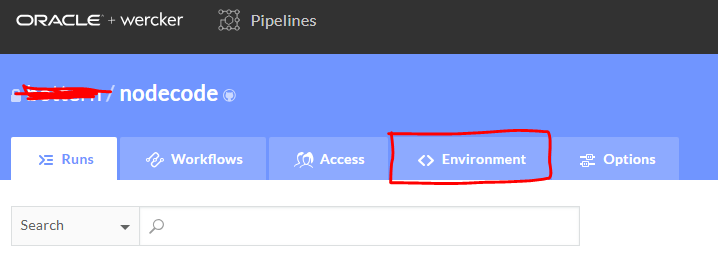

10. **Now is the time to select your squad!** Have a look at the squad credentials document. Look at the TV monitor for the bit.ly address to download the document. Note that the username, password, identity domain and identifier are unique for a squad. **Make sure your select the credentials for the squad you want to belong to!**
Fill in the environment variables based on your squad's credentials like below.

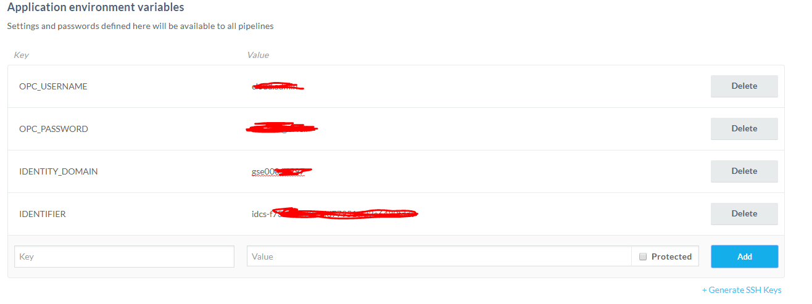

### Ready to Deploy

1. Let's first make a change to the GitHub repository to check that the automated build and deploy is working. As soon as you commit a difference in the repository, Wercker will start a build job and deploy a new version to Application Container Cloud.

You can either make changes in the GitHub editor (as shown below) or clone your repository to your computer, make changes locally and then push the changes to the remote GitHub repository.  

 **Node.js**: Open the file *xwingnodeclient/app.js* and on the first line insert a comment line with some text.
```                       
// My microservice!
```
 **Java**: Open the file *src/main/java/com/example/rest/App.java* and on the first line insert a comment line.
```
 // My microservice!
```
 **PHP**: Open the file *index.php* and edit the line on row 2 (below "<php") and insert a comment line.
```
// My microservice!
```
 **Ruby**: Open the file *app.rb* and insert a comment line.
```
# My microservice!
```
 **Go**: Open the file *service.go* and insert a comment line in the main() function.
```
// My microservice!
```
 **Python**: Open the file *app.py* and insert a comment line in the home() function.
```
# My microservice!
```

The screenshots below shows changing a file for the Node.js weapon

2. Go to your GitHub repository that you forked earlier. Select a file depending on your selected language (as described above).

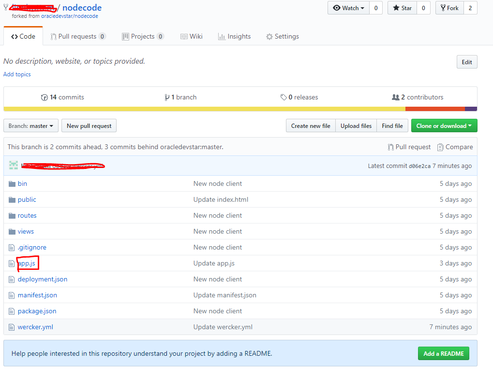

3. Press the Edit icon to start making changes to the file


4. Make a small change

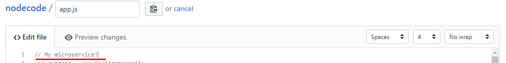

5. Save the file and commit the changes.

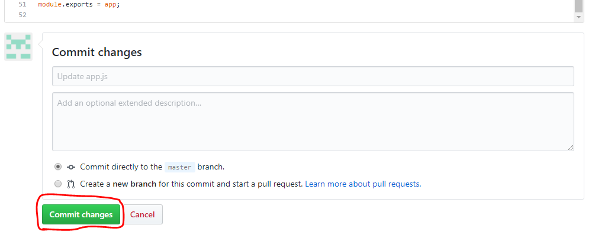

6. Monitor the Dev Star dashboard to await your fighter being deployed! If you can't see the Dashboard well on the projector/screen, just open the following url http://bit.ly/DevStarUI. Your space fighter should appear in the dashboard and complete it's first strike to the Alien War Ship!

If you want, you can check the progress of the build inside Wercker by pressing Runs and the build you want to monitor.

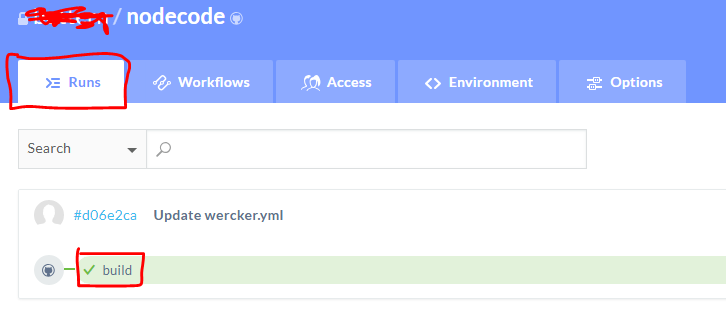

## Mission: Scale your first fighter! ##

### Mission Description ###

Your squad has now deployed one or several individual microservices (fighters). Our next mission will be add to another fighter to the squad by scaling up the number of instances for your fighter.

### Mission Awards ###

- Number of points for this mission: **100**

### Mission Instructions ###

1. Sign in to Application Container Cloud using the URL and credentials for your squad. You need to use the same identity domain, username and password that you used in the Wercker step before.

You need to enter your identity domain in the URL as: https://psm-YOUR_IDENTITY_DOMAIN_GOES_HERE.console.oraclecloud.com/apaas/faces/aPaaSRunner.jspx

2. Click your deployed application (yours is identified by your GitHub username).
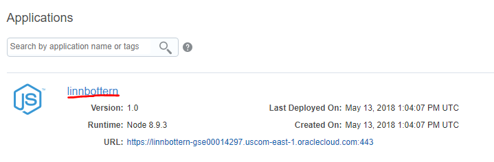

3. If your microservice is already deployed, you can view the logs. [Click here](logs.md) for instructions on how to view the logs. **Before you continue to the next step, make sure that you are able to retrieve and read the logs from your running application!**

4. You should now understand how to view the logs of your deployed application, if not, check the previous step before you continue. Increment the number of instances to 2. Please note that adding more than 1 instances do not give you any more points or advantages.
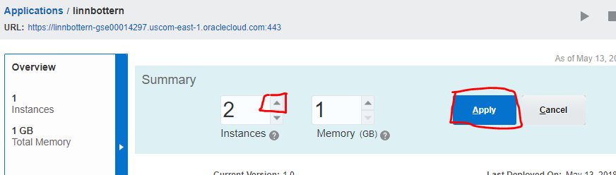


## Mission: Take down the shield! ##

### Mission Description ###

You and your squad are ready and you should now have one or more microservices with at least one of them having 2 instances.

The Alien War Ship is protected by it's powerful shield. As long as we can't break through the shield, we will have a hard time hitting the core reactors of the Alien War Ship.

### Mission Awards ###

- Number of points for this mission: **300**

### Mission Instructions ###

1. To start firing at the shield, we first need to have the Alien War Ship exposing it's coordinates. In the Dashboard, click on the Spy to see what information he has to share. You can navigate through the different missions by pressing Previous or Next.
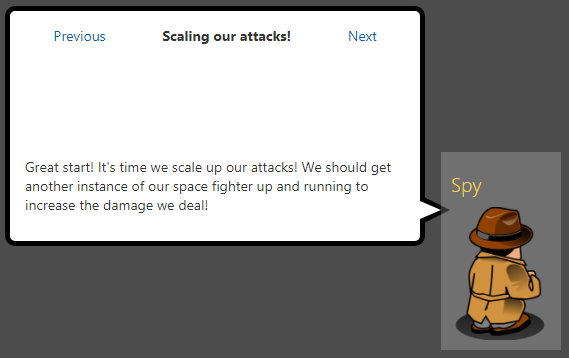

2. We now need to fire at the coordinates of the shield! You will do this by changing the code in your microservice and deploy the new version. 

- For Java, the file is located at src/main/java/com/example/rest/App.java 
- For Node.js, the file is located at xwingnodeclient/app.js 
- For PHP, the file is located at index.php
- For Ruby, the file is located at app.rb
- For Go, the file is located at service.go
- For Python, the file is located at app.py

The base URL of the shield is ```http://129.157.179.180:3000/shield/x-coordinate_goes_here/y-coordinate_goes_here/Your_squad_color_goes_here/Your_microservice_name_goes_here```. **The shield will get hit by HTTP GET Request bullets!**

**Hint: Make sure that your code/function is actually being called**

You need to look through your App.java, app.js or index.php file depending on your language and find out what changes you will need to make to invoke the shield's URL!

3. Deploy a new version of your microservice by either a) change the file the GitHub editor as instructed before or b) push the edited code to the Git repository.

4. When your updated microservice is live, it will hopefully hit the Alien War Ship's shield! **Note: Whenever you deploy a new version of your microservice, the number of instances/fighters will be set to 1. So don't worry when you see only 1 fighter in the Dashboard - you still received points for that mission**

5. If you feel that your microservice is not behaving correctly or might not have been deployed correctly, have a look at the logs as described [here](../logs.md).

## Mission: Shoot down the Mini Fighters ##

### Mission Description ###


The Alien War Ship has sent out 10 Mini Fighters to attack your fighters! You need to take them down as soon as possible. The mission is completed when a squad has shot down all the Mini Fighters.

### Mission Awards ###

- Number of points for this mission: **500**

### Mission Instructions ###

1. You should now have received information from the spy that will give you the y-coordinates of the Mini Fighters. The example below would shoot down ***one*** of the Mini Fighters. ***The x-coordinate is always locked at coordinate 45***.

```http://129.157.179.180:3000/fighters/45/y-coordinate_goes_here/Your_squad_color_goes_here/Your_microservice_name_goes_here```. **The Mini Fighters will get hit by HTTP GET Request bullets!**

**Hint: Notice the changed endpoint 'fighters'**

3. Deploy a new version of your microservice by pushing the edited code to the Git repository in the same way as for your first deployment.

3. When your updated microservice is live, it will hopefully hit the Mini Fighters sent out by the Alien War Ship!

4. If you feel that your microservice is not behaving correctly or might not have been deployed correctly, have a look at the logs as described [here](../logs.md).

### You are finished ###

Congratulations! You are finished and you have shot down the Alien War Ship. You can now title yourself a Dev Star. Check out the Hall of Fame on the dashboard for your final ranking!


