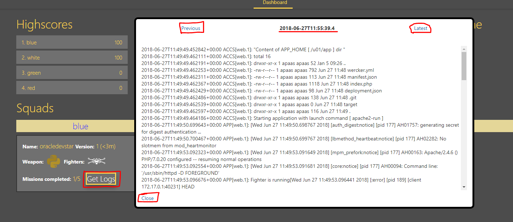

## Accessing log data

Logs can be used to view issues and/or information about the deployment/running status of the application in Application Container Cloud and give insight into errors on deployment or can serve debugging purposes. For example, Java's System.out.println and Node.js's console.log functions will print messages into this log.

There are two ways of accessing data.

#### Option 1 ####

Go to the Dashboard. Press the **Get Logs** button on **your** microservice. The log will take a couple of seconds to load. By default, the latest log will be shown. You can retrieve older logs by pressing the **Previous** button. To refresh to the latest log, press the **Latest** button. Dismiss the window by pressing the **Close** button.

#### Option 2 ####

Click on the Administration tab as shown in the image below.

Now select the Logs tabs and click the get logs button. A list of logs shows up. Clicking on any of them downloads the file. You might need to enter credentials to access the logs. Just use the ones provided to you in the Excel sheet if that is the case.

After a couple of seconds, refresh the page by clicking the refresh button next to the date on the top right.
Expand the Logs section and download and examine your logs.
